<div align="center">



<br>

[](https://github.com/darkClaw921/apistend/actions/workflows/ci.yml)
[](https://www.npmjs.com/package/apistend)
[](#каталог)
[](LICENSE)

**Демо-копии боевых API Bitrix24, Ozon Seller и Wildberries.**<br>
Те же схемы ответов, те же коды ошибок, те же события — без боевых данных и без лимитов.

</div>

---

Разработчик подменяет базовый адрес боевого API на адрес песочницы. Всё остальное
в его коде остаётся как было: путь, метод, заголовок авторизации, разбор ответа.

```diff
- curl https://api-seller.ozon.ru/v3/posting/fbs/list -H "Api-Key: $REAL"
+ curl http://localhost:8080/oz/v3/posting/fbs/list   -H "Api-Key: $STEND"
```

Шлюз принимает ключ там же, где его ждёт боевой сервис: `Authorization` у Wildberries,
`Client-Id` + `Api-Key` у Ozon, путь `/rest/{user}/{code}/` или параметр `auth=` у Bitrix24.
Клиентскую библиотеку переписывать не нужно — она шлёт то, что шлёт всегда.

## Что внутри

| | |
| --- | --- |
| **Каталог** | 2 421 метод: Bitrix24 — 1 685, Ozon — 420, Wildberries — 316 |
| **Источник** | официальные OpenAPI и документация сервисов, снимки зафиксированы по sha256 |
| **События** | нативный формат каждого сервиса, включая политику повторов и подписи |
| **Доставка на localhost** | WebSocket-туннель, публичный адрес не нужен |
| **Нагрузочная проверка** | серии событий с заданной скоростью и количеством |
| **Пропускная способность** | 20 500 запросов в секунду при p95 6,3 мс |

Каждый метод несёт происхождение: откуда взят ответ (`example` / `schema` / `generic`),
каким способом получен (`spec` / `mirror` / `parsed`), ссылку на страницу документации
и дату снимка. Неполнота видна, а не замаскирована.

## Документация

Полный справочник — на самом стенде, по адресу `/docs`: на поднятом локально это
<http://localhost:3100/docs>, на нашем — <https://apistend.ru/docs> (туда же ведёт
`docs.apistend.ru`).

| Раздел | О чём |
| --- | --- |
| [Начало](apps/web/src/content/docs/nachalo) | что такое стенд, быстрый старт, понятия, границы применимости |
| [Мок-API](apps/web/src/content/docs/mok-api) | адресация, авторизация, сценарии ответа, заголовки происхождения, лимиты |
| [События](apps/web/src/content/docs/sobytiya) | вебхуки, доставка на localhost, CLI, серии, журнал доставок |
| [Bitrix24](apps/web/src/content/docs/bitrix24) | стенд в роли портала: карточка приложения, OAuth, отладка |
| [Кабинет](apps/web/src/content/docs/kabinet) | свои моки, импорт OpenAPI, консоль, журнал, сводка |
| [API управления](apps/web/src/content/docs/api-upravleniya) | всё то же программно: ключ, области доступа, ресурсы, рецепты |
| [Установка](apps/web/src/content/docs/ustanovka) | запуск, переменные окружения, свой сервер, обновление, диагностика |

Исходники страниц — markdown в `apps/web/src/content/docs`; как их писать, описано
в [README-авторам.md](apps/web/src/content/docs/README-%D0%B0%D0%B2%D1%82%D0%BE%D1%80%D0%B0%D0%BC.md)
(на сайте — `/docs/avtoram`). Новая страница попадает в дерево, поиск и переходы
«предыдущая / следующая» сама: второго списка разделов в коде нет.

## Быстрый старт

```bash
docker compose up             # база, шлюз и кабинет: API :8080, веб :3100
```

Compose сам накатывает миграции и на пустой базе заводит демо-данные с ключами.
Вход: логин `demo`, пароль `apistend2026`.

<details>
<summary><b>Запуск для разработки, без контейнеров</b></summary>

<br>

Правки в исходниках подхватываются на лету, а в контейнер они попадут только
после пересборки образа — поэтому разрабатывать удобнее так:

```bash
docker compose up -d postgres # в контейнере только база
pnpm install
cp .env.example .env          # при необходимости поправьте JWT_SECRET
pnpm db:migrate
pnpm db:seed                  # демо-данные и ключи
pnpm dev                      # API :8080, веб :3100
```

</details>

Каталог методов лежит в репозитории собранным — `pnpm ingest` нужен, только чтобы
пересобрать его из спецификаций.

<details>
<summary><b>Проверить мок из терминала</b></summary>

<br>

```bash
KEY=<ключ из вывода pnpm db:seed>

# подстановка вместо боевого адреса
curl -s localhost:8080/wb/api/v3/warehouses -H "Authorization: $KEY" | jq

# Bitrix24: имя метода в пути, ключ там же, где его ждёт портал
curl -s 'localhost:8080/b24/rest/crm.deal.list' -H "X-Mock-Key: $KEY" | jq '.result[0], .total'

# сценарии ответа: success | invalid_token | not_found | rate_limit | server_error | timeout
curl -si localhost:8080/wb/api/v3/warehouses -H "Authorization: $KEY" \
  -H 'X-Mock-Scenario: rate_limit' | head -20
```

Каждый ответ несёт заголовки честности: `X-APIStend-Source`, `X-APIStend-Readiness`,
`X-APIStend-Scenario`, `X-APIStend-Snapshot` — видно, откуда взялось тело
и насколько метод готов.

</details>

## Вебхуки приходят на вашу машину

```bash
npx apistend login --api-key stend_sk_…
npx apistend listen --forward localhost:3000/webhooks
npx apistend trigger ONCRMDEALUPDATE
```

Публичный адрес не нужен: весь трафик инициирует агент, поэтому работает из-за NAT
и корпоративного файрвола. Приложение получает подлинный формат сервиса — у Bitrix24
это `x-www-form-urlencoded` с PHP-скобками и **только идентификатором объекта**,
как у боевого портала; значений полей в событии нет, за ними клиент обязан сходить
в `crm.deal.get`.

Политика доставки — свойство сервиса, а не транспорта:

| | Bitrix24 | Ozon | Wildberries |
| --- | --- | --- | --- |
| Content-Type | `x-www-form-urlencoded` | `application/json` | `application/json` |
| Успех | 2xx | **200 И тело `{"result": true}`** | строго 200 |
| Таймаут | не документирован | 5 с | 10 с |
| Повторы | **нет вообще** | до потолка 10 мин, 5 попыток | 10 с → 15 мин, затем событие удаляется |
| Подпись | `auth[application_token]` в теле | нет | HMAC-SHA256 в `X-Hub-Signature` |

Единая сетка повторов на всех сервисах дала бы ложную картину ровно в том сценарии,
ради которого инструмент и нужен: «что будет, если мой обработчик упал».

### Нагрузочная проверка

```bash
npx apistend trigger ONCRMDEALUPDATE --count 5000 --rate 200 --watch
```

```
> Серия ONCRMDEALUPDATE: 5000 событий по 200 соб/с ≈ 25 с
> Получатель: /bitrix/deal

   43 %  2150/5000  196 соб/с из 200
> Серия завершена: отправлено 5000 из 5000 · успешно 5000 · ошибок 0
```

Показывается **фактическая** скорость, а не заказанная. Если приложение не успевает
отвечать, серия притормаживает и пишет об этом — иначе замер показывал бы скорость
записи в сокет, а не скорость обработки. То же самое доступно на экране «Вебхуки»
кнопкой «Запустить» у сценария.

## Каталог

| Сервис | Методов | Источник | Лицензия источника |
| --- | ---: | --- | --- |
| Bitrix24 | 1 685 | [b24restdocs](https://github.com/bitrix24/b24restdocs) — YFM-Markdown, OpenAPI у сервиса нет | MIT |
| Ozon Seller | 420 | зеркало OpenAPI, снимок в `specs/ozon/SOURCE.json` | не объявлена |
| Wildberries | 316 | OpenAPI 3.0.1, 14 файлов | не объявлена |

Русские тексты Bitrix24 — с `apidocs.bitrix24.ru`: MIT-репозиторий существует только
на английском, а интерфейс русский. Описание есть у 100 % методов, по-русски — у 99,9 %.

<details>
<summary><b>Как собирается ответ мока</b></summary>

<br>

Три яруса по приоритету:

1. **Пример из спецификации** — 1 445 методов Bitrix24, 128 Ozon, 86 WB. Отдаём как есть.
2. **Схема и датасет** — `openapi-sampler` даёт скелет, детерминированный филлер
   подставляет значения. Детерминизм не через `faker.seed()`, а чистой функцией
   `value = f(hash(соль, тип, id, путь_поля))`: сид faker не гарантирован между версиями.
3. **Пустой конверт сервиса** — схемы нет, метод честно помечен `planned`.

Ответ — чистая функция от (метод, сценарий, объём датасета), это закреплено тестом
на детерминизм. Поэтому он кешируется без оговорок: **20 500 запросов в секунду
при p95 6,3 мс** против 4 546 и 107 мс до кеширования.

Соль кеша — объём датасета, а не идентификатор песочницы. Базовый набор данных общий
и read-only, персональные изменения живут в overlay. Ключей получается «методы × три
объёма», а не «методы × количество аккаунтов»: кеш из 50 000 записей покрывает каталог
целиком при любом числе пользователей.

</details>

## Состав

| Пакет | Назначение |
| --- | --- |
| `apps/web` | Next.js 16: лендинг и кабинет |
| `apps/api` | Fastify: мок-шлюз, каталог, ключи, журнал, вебхуки, туннель |
| [`packages/cli`](packages/cli) | npm-пакет [`apistend`](https://www.npmjs.com/package/apistend) |
| `packages/mock-engine` | резолвер ответов, детерминированная генерация, кеш |
| `packages/catalog-ingest` | спецификации и документация → каталог методов |
| `packages/ui` | дизайн-система по `design-handoff` |
| `packages/shared` | профили сервисов, конверты ошибок, протокол туннеля |

Дизайн — в `design-handoff/`. Он источник истины: экран принят, когда совпадает
с PNG при ширине 1440 px.

## Разработка

```bash
pnpm -w typecheck        # 8 пакетов
pnpm -w test             # 44 теста, включая сквозные с настоящим CLI
pnpm vendor:b24          # 25 МБ документации Bitrix24 + русские тексты
pnpm ingest              # спецификации -> packages/mock-engine/generated
```

Сквозные тесты поднимают настоящий сервер, настоящий CLI и фейковое приложение
в одном процессе на нулевых портах. Публичный домен для этого не нужен в принципе.

### Релиз пакета `apistend`

Публикацию делает GitHub Actions по тегу — руками `npm publish` не запускается,
иначе в реестр однажды уедет сборка с чьей-то машины.

```bash
# версия в packages/cli/package.json и VERSION в packages/cli/src/cli.ts
git tag apistend-v1.5.2 && git push origin apistend-v1.5.2
```

**Токена в секретах нет и не нужно.** Пакет настроен на доверенную публикацию: npm
обменивает OIDC-токен GitHub Actions на право записи именно в `apistend` и только
из `.github/workflows/publish-cli.yml`. Красть из репозитория нечего, срок ничему
не истекает, provenance выдаётся сам.

## Диагностика

`GET /health` показывает попадания кешей, долю выборки журнала, потери и RSS.
Журнал запросов выше 300 строк в секунду прореживается — доля выборки видна
и в `/health`, и в интерфейсе.

## Правовое

APIStend не связан с правообладателями; названия сервисов используются для указания
совместимости. Источники, лицензии и даты снимков — в [NOTICE.md](NOTICE.md).
Код — под [MIT](LICENSE).
